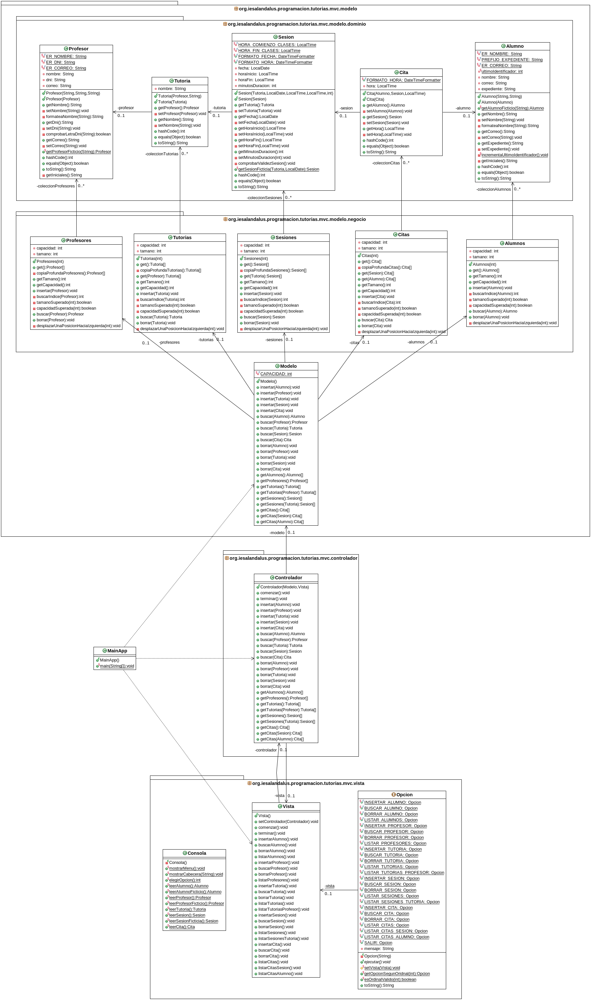

# Tarea: Tutorías IES Al-Ándalus
## Profesor: José Ramón Jiménez Reyes
## Alumno:

La tarea va a consistir en modelar la gestión de tutorías para la FP Semipresencial del IES Al-Ándalus. Después de todas las especificaciones y requerimientos anotados, en este **primer spring** de la aplicación se ha decidido abarcar los siguientes:

- Los profesores planificarán tutorías. Una tutoría de un profesor podrá tener una o varias sesiones. Un alumno podrá reservar una o varias citas para una sesión dada.
- Un **alumno** se identifica por su **nombre** (que constará de al menos dos palabras correspondientes al nombre y un apellido) y su **correo electrónico** (que debe ser correcto). Una vez creado un alumno no podremos cambiarle ni el nombre ni el correo electrónico. Se considera que dos alumnos son los mismos si su correo electrónico es el mismo. A la hora de almacenar un alumno también almacenaremos un atributo interno correspondiente a su código de **expediente** que formaremos añadiendo al prefijo "**SP_**" las iniciales del alumno, seguido de un guión bajo y un número único para el mismo que coincidirá con el número de alumnos que se hayan ido dando de alta (correspondiente al atributo **ultimoIdentificador**). También formatearemos el nombre del alumno, eliminando espacios en blanco sobrantes y poniendo la primera letra de cada palabra en mayúsculas y las siguientes en minúsculas. Para mostrar un alumno, mostraremos su nombre, seguido de sus iniciales, su correo electrónico y su código de expediente. La aplicación permitirá **insertar un alumno**, **borrar un alumno** basándonos en el correo electrónico del mismo, **buscar un alumno** basándonos en el correo electrónico del mismo y **listar los alumnos** dados de alta.
- Un **profesor** se identifica por su **nombre**, su **DNI** (que debe ser correcto -formato y letra correcta-) y su **correo electrónico** (que debe ser correcto). Una vez creado un profesor no podremos cambiar ninguno de sus atributos. A la hora de almacenar un profesor formatearemos el nombre del profesor, eliminando espacios en blanco sobrantes y poniendo la primera letra de cada palabra en mayúsculas y las siguientes en minúsculas. Se considera que dos profesores son iguales si sus DNIs son iguales. Para mostrar un profesor mostraremos sus diferentes atributos. La aplicación permitirá **insertar un profesor**, **borrar un profesor** basándonos en su DNI, **buscar un profesor** basándonos en su DNI y **listar los profesores** dados de alta.
- Un profesor planifica tutorías durante el curso. Una **tutoría** se identifica por su **nombre** y el **profesor** que la ha planificado. Una vez creada una tutoría no podremos cambiar ninguno de sus atributos. Se considera que dos tutorías son iguales si las ha planificado el mismo profesor y tienen el mismo nombre. Para mostrar una tutoría mostraremos su nombre y los atributos del profesor. La aplicación permitirá **insertar una tutoría**, **borrar una tutoría**, **buscar una tutoría**, **listar las tutorías** dadas de alta y **listar las tutorías planificadas por un profesor** en concreto.
- Una tutoría se compone de una o varias sesiones. Una **sesión** se identifica por la **tutoría** a la que pertenece, la **fecha** de la misma, la **hora de inicio**, la **hora de fin** y los **minutos de duración** que se asignarán a cada cita en dicha sesión. Para crear una sesión debemos tener en cuenta que la fecha debe ser posterior al día actual, que la hora de inicio y de fin estén comprendidas entre la hora de comienzo de las clases (16:00) y fin de las clases (22:15), que la hora de inicio es menor que la hora de fin y que el intervalo comprendido entre la hora de inicio y de fin es múltiplo de los minutos de duración. Una vez creada una sesión no podremos cambiar ninguno de sus atributos. Se considera que dos sesiones son iguales si pertenecen a la misma tutoría y tienen la misma fecha, por lo que no podrá haber dos sesiones para una tutoría con la misma fecha. Para mostrar una sesión mostraremos los atributos de la tutoría a la que pertenece y los suyos propios. La aplicación permitirá **insertar una sesión**, **borrar una sesión**, **buscar una sesión**, **listar las sesiones** dadas de alta y **listar las sesiones de una tutoría** concreta.
- Los alumnos reservan citas para una sesión concreta. Una **cita** se identifica por el **alumno** que la reserva, la **sesión** para la que la reserva y la **hora** a la que reserva. Para crear la cita debemos tener en cuenta que la hora debe estar comprendida entre la hora de inicio y fin de la sesión y que dicha hora corresponde con la hora de inicio más un múltiplo de los minutos de duración. Una vez creada una cita no podremos cambiar ninguno de sus atributos. Se considera que dos citas son iguales si son iguales el alumno, la sesión y la hora. Para mostrar una cita mostraremos el alumno, la sesión y la hora. La aplicación nos permitirá **insertar una cita**, **borrar una cita**, **buscar una cita**, **listar las citas** dadas de alta, **listar las citas reservadas por un alumno** y **listar las citas para una sesión**.
- En este spring no contemplaremos ninguna restricción más ni a la hora de insertar ni a la hora de borrar, por lo que se podrán quedar datos inconsistentes que ya abarcaremos en el siguiente spring.

Tu tarea consiste en realizar una aplicación para gestionar las tutorías en la FP Semipresencial para el IES Al-Ándalus. Con los conocimientos adquiridos hasta el momento realizaremos una implementación basada en arrays para gestionar las colecciones. Aplicaremos el patrón MVC (haciendo una primera aproximación al mismo que poco a poco iremos mejorando cuando adquiramos los conocimientos necesarios) por lo que haremos una distinción entre la **vista** (encargada de interaccionar con el usuario), el **modelo** (encargado de gestionar los datos) que dividiremos entre clases de dominio (DTO) y clases de negocio (DAO) que nos permiten interactuar con las colecciones y el **controlador** (encargado de dirigir toda esta orquesta).

Debes tener en cuenta el problema existente con las referencias (aunque en principio no podamos modificar ninguno de los atributos de las clases expuestas -se consideran clases inmutables-, quiero que te acostumbres a tenerlo en cuenta). Por ello para cada clase que sea cliente de otra deberás devolver referencias a objetos nuevos en los métodos de acceso y también crear nuevas referencias a nuevos objetos cuando los vayamos a asignar a atributos. En los métodos de las clases de negocio también deberás devolver una copia profunda de los elementos de la colección en dicho método de acceso.

También siempre se deben validar todos los valores que se intentan asignar y si no lanzar una excepción adecuada para evitar inconsistencias en el estado de los objetos.

Para ello te pongo un diagrama de clases para el mismo y poco a poco te iré explicando los diferentes pasos a realizar:

He subido a GitHub un esqueleto de proyecto gradle que ya lleva incluidos todos los test necesarios que el programa debe pasar. Dichos test están todos comentados y deberás ir descomentándolos conforme vayas avanzando con la tarea. La URL del repositorio es en la que te encuentras.

Por tanto, tu tarea va a consistir en completar los siguientes apartados:

1. Lo primero que debes hacer es realizar un **fork** del repositorio donde he colocado el proyecto gradle con la estructura del proyecto y todos los test necesarios. Clonar tu repositorio remoto recién copiado en github a un repositorio local que será donde irás realizando lo que a continuación se te pide. Añade tu nombre al fichero `README.md` en el apartado "Alumno". Realiza tu primer commit.
2. Crea la clase `Alumno`, en el paquete adecuado, con los atributos y métodos especificados en el diagrama y la visibilidad adecuada. Crea el **constructor con parámetros** y el **constructor copia**. Crea los métodos `get` y `set` con la visibilidad adecuada. En todos los casos se debe comprobar la validez de los parámetros pasados antes de asignarlos y en caso de que no sean válidos lanzar la excepción adecuada. Ten en cuenta los requisitos comentados al principio y recuerda asignar el **código de expediente**, **formatear el nombre** adecuadamente y tratar adecuadamente el atributo `ultimoIdentificador` (para ello está método `incrementaUltimaIdentificador`). El método `getAlumnoFicticio` simplemente devolverá un alumno con un nombre válido y el correo pasado por parámetro y que luego utilizaremos para las búsquedas y los borrados. Crea los métodos `hashCode`, `equals` y `toString`. Asegurate de que se pasan todos los tests asociados a esta clase. Realiza el commit correspondiente.
3. Crea la clase `Profesor`, en el paquete adecuado, con los atributos y métodos especificados en el diagrama y la visibilidad adecuada. Crea el **constructor con parámetros** y el **constructor copia**. Crea los métodos `get` y `set` con la visibilidad adecuada. En todos los casos se debe comprobar la validez de los parámetros pasados antes de asignarlos y en caso de que no sean válidos lanzar la excepción adecuada. Ten en cuenta los requisitos comentados al principio. El método `getProfesorFicticio` simplemente devolverá un profesor con un nombre válido, un correo válido y el dni pasado por parámetro y que luego utilizaremos para las búsquedas y borrados. Crea los métodos `hashCode`, `equals` y `toString`. Asegurate de que se pasan todos los tests asociados a esta clase. Realiza el commit correspondiente.
4. Crea la clase `Tutoria`, en el paquete adecuado, con los atributos y métodos especificados en el diagrama y la visibilidad adecuada. Crea el **constructor con parámetros** y el **constructor copia**. Crea los métodos `get` y `set` con la visibilidad adecuada. En todos los casos se debe comprobar la validez de los parámetros pasados antes de asignarlos y en caso de que no sean válidos lanzar la excepción adecuada. Ten en cuenta los requisitos comentados al principio. Crea los métodos `hashCode`, `equals` y `toString`. Asegurate de que se pasan todos los tests asociados a esta clase. Realiza el commit correspondiente.
 5. Crea la clase `Sesion`, en el paquete adecuado, con los atributos y métodos especificados en el diagrama y la visibilidad adecuada. Crea el **constructor con parámetros** y el **constructor copia**. Crea los métodos `get` y `set` con la visibilidad adecuada. En todos los casos se debe comprobar la validez de los parámetros pasados antes de asignarlos y en caso de que no sean válidos lanzar la excepción adecuada. Ten en cuenta los requisitos comentados al principio haciendo especial hincapié en los atributos `fecha`, `horaInicio`, `horaFin` y `minutosDuracion`. El método `getSesionFicticia` simplemente devolverá una sesión con una `horaInicio`, `horaFin` y `minutosDuracion` válidos y la `tutoria` y `fecha` pasadas por parámetro y que luego utilizaremos para las búsquedas y borrados. Crea los métodos `hashCode`, `equals` y `toString`. Asegurate de que se pasan todos los tests asociados a esta clase. Realiza el commit correspondiente.
6. Crea la clase `Cita`, en el paquete adecuado, con los atributos y métodos especificados en el diagrama y la visibilidad adecuada. Crea el **constructor con parámetros** y el **constructor copia**. Crea los métodos `get` y `set` con la visibilidad adecuada. En todos los casos se debe comprobar la validez de los parámetros pasados antes de asignarlos y en caso de que no sean válidos lanzar la excepción adecuada. Ten en cuenta los requisitos comentados al principio, haciendo especial hincapié en la `hora` teniendo en cuenta su relación con las horas y minutos de duración de la sesión. Crea los métodos `hashCode`, `equals` y `toString`. Asegurate de que se pasan todos los tests asociados a esta clase. Realiza el commit correspondiente.
7. Crea la clase `Alumnos`, en el paquete adecuado, con los atributos y métodos especificados en el diagrama y la visibilidad adecuada. Recuerda que el método `get` devolverá una copia profunda de la colección. Se permitirá **insertar** elementos al final de la colección sin admitir repetidos, **buscar** y **borrar** desplazando los elementos hacia la izquierda para dejar el array compactado. Asegurate de que se pasan todos los tests asociados a esta clase. Realiza el commit correspondiente.
8. Crea la clase `Profesores`, en el paquete adecuado, con los atributos y métodos especificados en el diagrama y la visibilidad adecuada. Recuerda que el método `get` devolverá una copia profunda de la colección. Se permitirá **insertar** elementos al final de la colección sin admitir repetidos, **buscar** y **borrar** desplazando los elementos hacia la izquierda para dejar el array compactado. Asegurate de que se pasan todos los tests asociados a esta clase. Realiza el commit correspondiente.
9. Crea la clase `Tutorias`, en el paquete adecuado, con los atributos y métodos especificados en el diagrama y la visibilidad adecuada. Recuerda que los métodos `get` devolverán una copia profunda de la colección resultante. Se permitirá **insertar** elementos al final de la colección sin admitir repetidos, **buscar** y **borrar** desplazando los elementos hacia la izquierda para dejar el array compactado. Asegurate de que se pasan todos los tests asociados a esta clase. Realiza el commit correspondiente.
10. Crea la clase `Sesiones`, en el paquete adecuado, con los atributos y métodos especificados en el diagrama y la visibilidad adecuada. Recuerda que los métodos `get` devolverán una copia profunda de la colección resultante. Se permitirá **insertar** elementos al final de la colección sin admitir repetidos, **buscar** y **borrar** desplazando los elementos hacia la izquierda para dejar el array compactado. Asegurate de que se pasan todos los tests asociados a esta clase. Realiza el commit correspondiente.
11. Crea la clase `Citas`, en el paquete adecuado, con los atributos y métodos especificados en el diagrama y la visibilidad adecuada. Recuerda que los métodos `get` devolverán una copia profunda de la colección resultante. Se permitirá **insertar** elementos al final de la colección sin admitir repetidos, **buscar** y **borrar** desplazando los elementos hacia la izquierda para dejar el array compactado. Asegurate de que se pasan todos los tests asociados a esta clase. Realiza el commit correspondiente.
12. Crea la clase `Modelo`, en el paquete adecuado, con los atributos y métodos especificados en el diagrama y la visibilidad adecuada. Cada método deberá hacer una llamada al método homólogo del objeto adecuado. Asegurate de que se pasan todos los tests asociados a esta clase. Realiza el commit correspondiente.
13. Crea la clase `Consola`, en el paquete adecuado, teniendo en cuenta que será una clase de utilidades de la cual no queremos que se puedan instanciar objetos. Crea los métodos especificados en el diagrama, teniendo en cuenta que cada uno de los métodos realizará la función que su nombre indica, es decir, pedir por teclado las variables convenientes, que en algunos casos deberá transformar como en el caso de las fechas, para poder devolver el objeto de dominio correspondiente. El método `mostrarCabecera` mostrará la cadena pasada por parámetro y debajo de la misma una cadena compuesta de tantos caracteres '-' como su longitud. Realiza el commit correspondiente.
14. Crea el enumerado `Opcion`, en el paquete adecuado, cuyas instancias corresponderán con cada una de las opciones del menú de nuestra aplicación. Cada instancia aceptará en su constructor una cadena correspondiente al mensaje que se mostrará por pantalla para dicha opción. Debes crear los atributos y métodos que se especifican en el diagrama, teniendo en cuenta que el método `ejecutar` es abstracto por lo que en la declaración general no tendrá implementación, pero que deberá ser implementado en cada una de las instancias haciendo una llamada al correspondiente método de la clase `Vista`. El método getOpcionSegunOrdinal devolverá la instancia de Opcion que ocupe el ordinal pasado por parámetro. El método `esOrdinalValido` devolverá un `boolean` indicando si el ordinal pasado por parámetro está dentro de los posibles ordinales. El método `toString` devolverá la cadena correspondiente a la concatenación del ordinal de la opción, la cadena " .- " y el mensaje a mostrar por la opción en cuestión. Por último, el método `setVista` asignará el valor pasado al atributo `vista`, que aunque aún no exista, crearás en el siguiente paso. Realiza el commit correspondiente.
15. Crea la clase `Vista`, en el paquete adecuado, con los atributos y métodos especificados en el diagrama. Esta clase hará uso de los métodos de la clase `Consola` para pedir los datos y llamará al método adecuado de la clase `Controlador`. El método `comenzar` será un bucle que mostrará el menú, pedirá la opcion deseada y la ejecutará, así hasta que la opción elegida sea `SALIR`. El método `terminar` simplemente llamará al método `terminar` de la clase `Controlador`. Realiza el commit correspondiente.
16. Crea la clase `Controlador`, en el paquete adecuado, con los atributos y métodos especificados en el diagrama. Esta clase asignará los valores a los atributos y llamará al método `setControlador` de la clase `Vista` para que dicha clase tenga una referencia a ésta. El método `comenzar` llamará al método `comenzar` de la vista. Los demás métodos llamarán a sus métodos homólogos de la clase `Modelo`. Realiza el commit correspondiente.
17. Crea la clase `MainApp` que simplemente creará un objeto de la clase `Modelo`, otro de la clase `Vista` y otro de la clase `Controlador` pasándole los dos anteriores y luego llamará al método `comenzar`. Realiza el commit correspondiente.

###### Se valorará:
- La indentación debe ser correcta en todas las clases.
- El nombre de las variables debe ser adecuado.
- Se debe utilizar la clase `Entrada` para realizar la entrada por teclado.
- El proyecto debe pasar todas las pruebas que van en el esqueleto del mismo y toda entrada del programa será validada para evitar que el programa termine abruptamente debido a una excepción.
- Se deben utilizar los comentarios adecuados.
- Se valorará la corrección ortográfica tanto en los comentarios como en los mensajes que se muestren al usuario.

